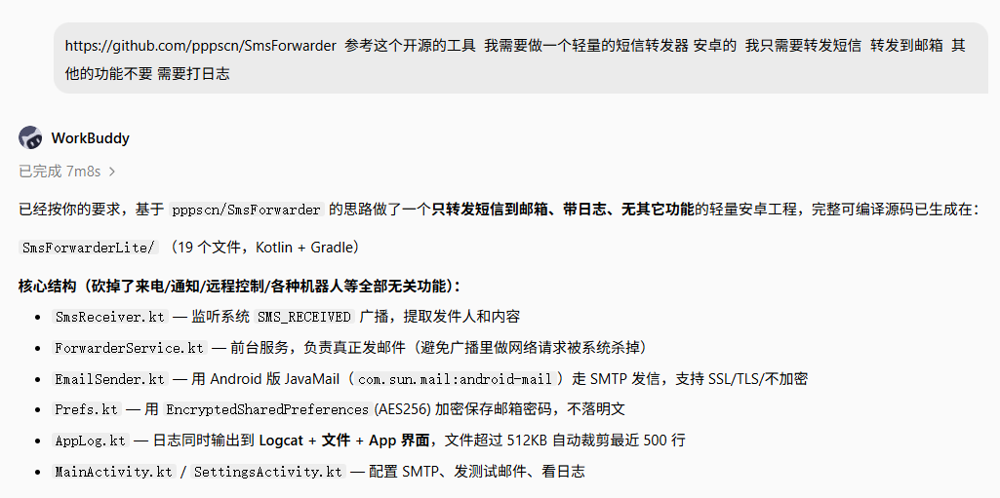
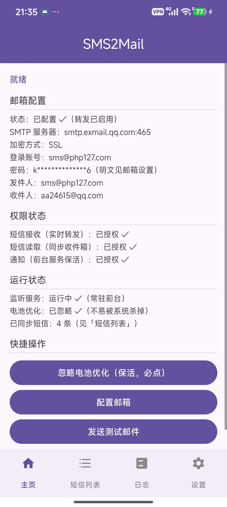
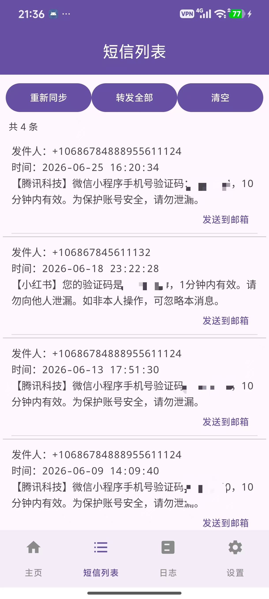
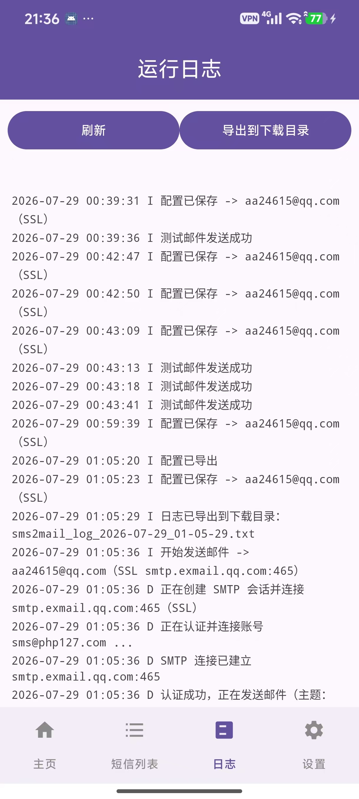
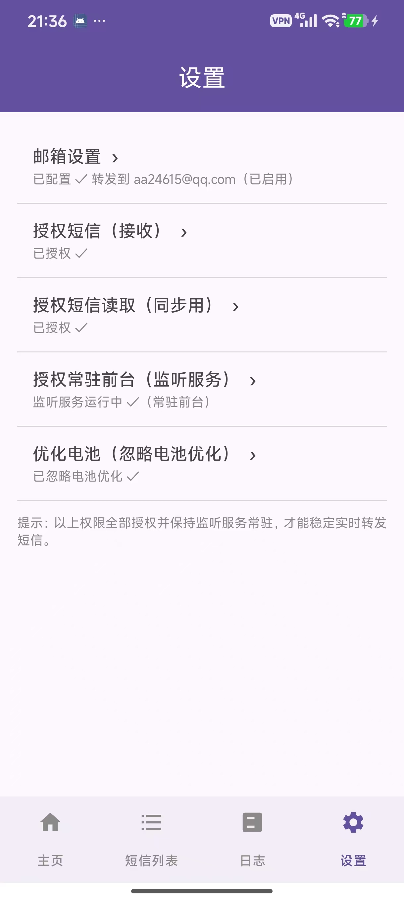

# SMS2Mail 界面截图

本文档用于存放和说明 SMS2Mail 的相关截图。

## 项目由来

> 基于 [pppscn/SmsForwarder](https://github.com/pppscn/SmsForwarder) 的思路，做一个只保留「短信 → 邮箱」核心能力的轻量安卓短信转发器。

## App 界面预览

以下均为真机运行截图（图中的测试短信、手机号/验证码已做脱敏处理）。

### 1. 首页：状态总览

展示邮箱配置、权限状态、运行状态与快捷操作。

### 2. 短信列表

同步本地收件箱后的短信列表，支持单条「发送到邮箱」。

### 3. 运行日志

实时显示配置保存、测试邮件、SMTP 连接、短信转发等运行日志。

### 4. 设置

邮箱设置、短信权限授权、常驻前台监听服务、电池优化入口。

